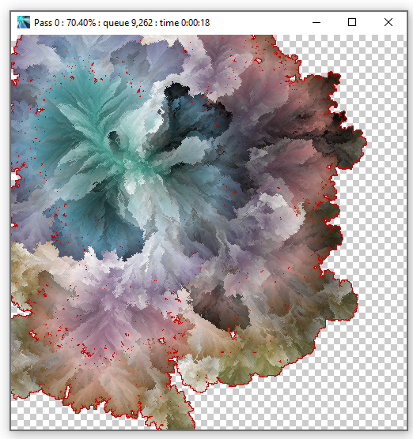

# All The Colors

A C# application based off the idea and top-voted post in this [code golf post](https://codegolf.stackexchange.com/questions/22144/images-with-all-colors).

The basic idea is to create a single image that shows all of the possible colors.  The top voted post used a unique method of starting with a set color, then picking random pixels near a set pixel that look similar to the drawn pixels.  To give you an idea of what this looks like, here's an image of a [completed render](images/wallpaper.png) that I use for my wallpaper, and here's an [early animation](https://www.youtube.com/watch?v=mO7VuqLNK1w) showing how this process picks pixels. 

I liked the result, so I expanded on it a bit, with two ideas:

My generator by default uses what it calls "Pastel Colors".  This is an attempt to pick an HSV->RGB conversion that takes [perceptual brightness into account](https://www.vis4.net/blog/2011/12/avoid-equidistant-hsv-colors/).  The formula is based off the linked post, and was tweaked till I was happy with the output.

The pixel picker uses an [Octree](https://en.wikipedia.org/wiki/Octree), which can be thought of as a three-dimensional binary tree, to track which pixels to work on.

To use it, just compile and run, it will produce an output with some defaults.  You can also pass in a filename that doesn't exist, and it'll create a settings file with some defaults, ready to be edited with new options.
